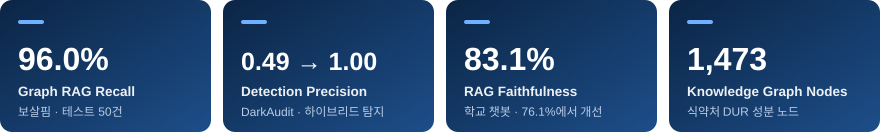
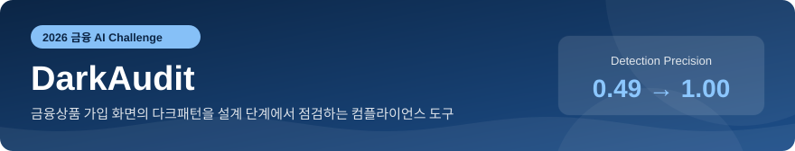
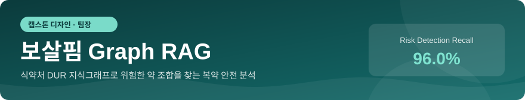
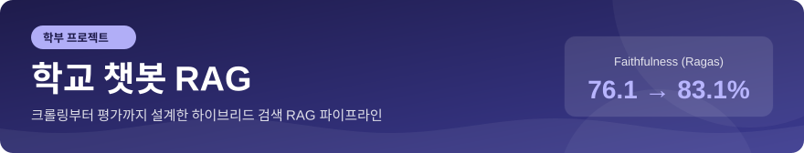

<!-- TODO: 이메일·블로그 주소, 이력 표의 YYYY.MM 기간, 학교 챗봇 저장소 링크 -->

  

  

  
  
  

## 🙋‍♂️ About Me

<table>
  <tr>
    <td width="56%" valign="top">
      <h3>금융과 IT를 잇는 개발자, 이정현입니다</h3>
      
금융 규정과 공공 데이터를 <b>검증 가능한 AI 서비스</b>로 만드는 일을 합니다.

      
금융위원회 다크패턴 가이드라인을 룰 엔진으로, 식약처 DUR 데이터를 지식그래프로 옮겼습니다.
      판단은 규칙과 데이터가 하고 LLM은 근거를 검증·설명하도록 설계하는 것을 선호합니다.

    </td>
    <td width="44%" valign="top">
      
🎓 <b>Education</b> 금오공과대학교 컴퓨터공학 (2026.08 졸업)

      
🏫 <b>Training</b> SSAFY 16기 데이터 트랙

      
🔬 <b>Research</b> 데이터마이닝 연구실 학부연구생

      
🎯 <b>Target</b> 금융권 IT · AI · 데이터 개발

    </td>
  </tr>
</table>

## 🏆 Key Results

  

## 🛠 Tech Stack

<table>
  <tr>
    <td align="center" width="140"><b>Language</b></td>
    <td>
      
      
      
    </td>
  </tr>
  <tr>
    <td align="center"><b>AI · Data</b></td>
    <td>
      
      
      
      
      
    </td>
  </tr>
  <tr>
    <td align="center"><b>Backend</b></td>
    <td>
      
      
      
      
    </td>
  </tr>
  <tr>
    <td align="center"><b>Database</b></td>
    <td>
      
      
      
      
    </td>
  </tr>
  <tr>
    <td align="center"><b>DevOps · Tools</b></td>
    <td>
      
      
      
      
      
    </td>
  </tr>
</table>

## 📊 GitHub Stats

  
  

## 📁 Projects

| 기간 | 역할 | 팀 | 기술 스택 |
| :---: | :---: | :---: | :--- |
| 2026 | Data Engineer | 2인 | Python, FastAPI, SQLAlchemy, Playwright, Docker, OpenAI API |

금융위원회 다크패턴 가이드라인(2025.12)의 15개 유형을 규칙으로 만들어, 금융상품 가입 화면을 설계 단계에서 점검하는 서비스입니다.

- 15개 유형을 YAML Rule Base로 정리하고 룰 엔진 구현
- 룰 엔진이 후보를 찾고 LLM이 검증하는 하이브리드 구조로 **Precision 0.49 → 1.00, F1 0.66 → 0.77**
- FastAPI 백엔드 구축, 인메모리 저장소를 SQLAlchemy DB로 전환
- 이미지 업로드와 Figma 가져오기가 같은 분석 로직을 쓰도록 입력 경로 통합

🔗 [sogeumbbang/DarkAudit](https://github.com/sogeumbbang/DarkAudit)

 

| 기간 | 역할 | 팀 | 기술 스택 |
| :---: | :---: | :---: | :--- |
| 2026.03 ~ 06 | 팀장 (Graph RAG) | 4인 | Neo4j, NestJS, GPT-4o-mini, CODEF API |

고령자·1인 가구를 위한 통합 건강·안전 앱 「보살핌」에서 함께 먹으면 위험한 약 조합을 찾아 알려주는 복약 분석 파트를 만들었습니다.

- 식약처 DUR API로 성분 1,473개, 병용금기 관계 1,313개를 Neo4j 지식그래프로 구축
- 2홉 Cypher 쿼리로 직접 연결되지 않은 간접 위험 경로까지 탐지
- CODEF API로 처방전 데이터 연동
- 위험 판단은 그래프가, 설명은 LLM이 맡도록 역할 분리
- 테스트 50건 기준 **Recall 96.0%** (Vanilla RAG 45.7%, LLM 단독 28.3%)

🔗 [oncare24/Graph_RAG](https://github.com/oncare24/Graph_RAG)

 

| 구분 | 역할 | 기술 스택 |
| :---: | :---: | :--- |
| 학부 프로젝트 | RAG 파이프라인 담당 | Python, Qdrant, bge-m3, Cross-Encoder, Ragas |

학교 안내 챗봇의 검색 파이프라인을 설계하고, Ragas 지표를 보면서 검색 구조를 개선했습니다.

- 크롤링, 정규화, 청킹, 임베딩으로 이어지는 ETL 파이프라인 구축
- Semantic + BM25 하이브리드 검색과 Cross-Encoder 리랭킹 적용
- **Precision 62.5% → 70.4%, Faithfulness 76.1% → 83.1%**

<!-- TODO: 공개 저장소가 있으면 링크 추가 -->

 

## 📂 Other Projects

| 프로젝트 | 내용 | 역할 |
| --- | --- | --- |
| 💳 소비 페르소나 분류 · 금융 혜택 추천 | 신용카드 거래 185만 건과 Bank Marketing 데이터로 소비 유형을 나누고 맞춤 혜택 추천 | 금융 특화 데이터 분석 부트캠프 최종 프로젝트 |
| 🎤 [면접장](https://github.com/Mystery2LEE/CS_Quiz_Site) | AI로 CS 면접 문제를 만들고 모의면접까지 할 수 있는 스터디 사이트 | 기획·개발 (Next.js, Redis, Claude API) |
| ⛺ [BASE CAMP](https://github.com/Mystery2LEE/Python_Algorithm_Study) | push하면 풀이가 Notion에 자동 기록되는 GitHub Actions 파이프라인 | 5인 알고리즘 스터디 리드 |
| 🔥 불마루 | 산불 대응 AI Agent (KT 믿:음 2.0) | K intelligence 해커톤 2025, 기획·모델 설계 |
| 📚 [RAGFlow Demo](https://github.com/Mystery2LEE/ragflow-demo) | 문서 파싱부터 답변 생성까지 단계별로 보여주는 교육용 RAG 데모 | 개인 프로젝트 (Streamlit) |

## 📜 Experience

| 기간 | 활동 | 내용 |
| :---: | --- | --- |
| 2026.07 ~ | SSAFY 16기 데이터 트랙 | 삼성 청년 SW 아카데미 |
| 2026 | 2026 금융 AI Challenge | 팀 소금빵, DarkAudit 출품 |
| 2026 | 2026 연구 아이디어 기술사업화 챌린지 | 팀 POCHA Vision, 예선 통과 |
| 2026.08 | 금오공과대학교 컴퓨터공학 졸업 | |
| 2026.03 ~ 2026.06 | 캡스톤 디자인 「보살핌」 | 4인 팀 팀장 |
| 2025 | K intelligence 해커톤 2025 | Track 1 AI Agent 「불마루」 |
| YYYY.MM ~ YYYY.MM | 데이터마이닝 연구실 학부연구생 | NLP, 추천 시스템, 시계열 이상탐지 |
| YYYY.MM ~ YYYY.MM | 금융 특화 데이터 분석 부트캠프 | 9주 심화반 수료 |

## 📝 Certificates

| 자격 | 발급 기관 | 상태 |
| --- | --- | :---: |
| ADsP (데이터분석 준전문가) | 한국데이터산업진흥원 | 취득 |
| 정보처리기사 | 한국산업인력공단 | 필기 합격 |

  

