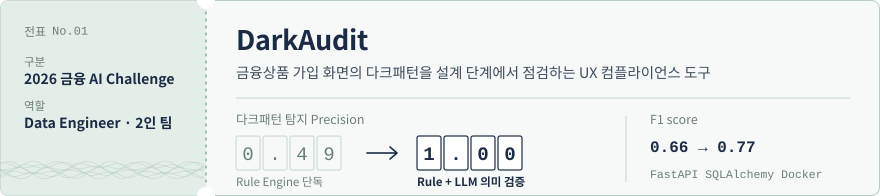
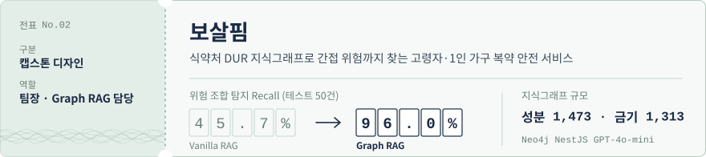
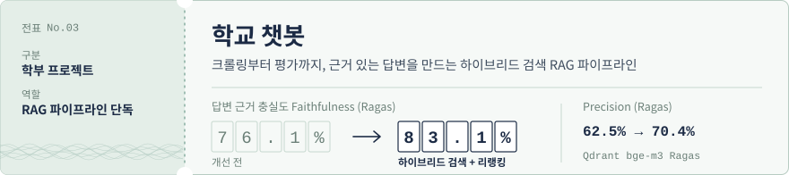

<!--
  배포 전 확인할 곳 (검색: TODO)
  1) 이메일·블로그 주소
  2) 이력 표의 YYYY.MM 기간
  3) 학과명 정식 표기
  4) 학교 챗봇 저장소 링크
-->

  

  
  
  

세무사 시험을 2년 반 준비하며 세법과 회계 규정을 읽었고, 지금은 그 규정을 코드로 옮깁니다.
금융위원회 다크패턴 가이드라인을 기계가 판독하는 규칙으로, 식약처 DUR 병용금기 데이터를 지식그래프로 바꾸는 일을 해 왔습니다.

판단은 규칙과 데이터가 하고, LLM은 그 근거를 검증하고 설명하는 구조를 선호합니다.
결과에 책임이 따르는 금융 도메인에서 AI를 쓰는 방식이라고 생각합니다.

 

## 대표 프로젝트

금융상품 가입 화면의 다크패턴은 출시 뒤에 발견하면 고치는 비용이 큽니다.
금융위원회 「온라인 금융상품 판매 관련 다크패턴 가이드라인」(2025.12)의 15개 유형을 Figma·와이어프레임 단계에서 미리 걸러내는 도구를 만들고 있습니다. 2인 팀에서 룰 엔진, 데이터 파이프라인, 백엔드, 배포를 맡았습니다.

| 담당 영역 | 구현 내용 |
| --- | --- |
| 룰 엔진 | 15개 유형을 YAML Rule Base로 관리하고, 규칙 검증·JSON 빌드 도구 구성 |
| 하이브리드 탐지 | 룰 엔진이 후보를 넓게 잡고(Recall 1.00) LLM 의미 검증이 오탐을 걸러 Precision 0.49 → 1.00 |
| 백엔드 | FastAPI Audit API, 인메모리 저장소를 SQLAlchemy DB로 전환, 프론트엔드 계약 버전 게이트로 호환 유지, 테스트 46개 통과 |
| 입력 경로 | 화면 업로드와 Figma 가져오기가 하나의 분석 함수를 공유하도록 구조 정리 |

**트레이드오프** 하이브리드 적용 후 Recall이 0.63으로 내려갔습니다. 규칙별로 LLM 검증을 건너뛰는 전략을 검토하며 누락을 줄이고 있습니다.

`Python` `FastAPI` `SQLAlchemy` `Playwright` `Docker` `Figma API` `OpenAI API`

[저장소 보기](https://github.com/hypoxisaurea/DarkAudit)

 

여러 병원에서 약을 처방받는 고령자·1인 가구를 위한 통합 건강·안전 앱입니다. 4인 팀의 팀장으로 Graph RAG 기반 복약 분석을 맡았습니다. (2026.03 ~ 2026.06)

| 담당 영역 | 구현 내용 |
| --- | --- |
| 지식그래프 | 식약처 DUR API로 성분 노드 1,473개, 병용금기 엣지 1,313개를 Neo4j에 구축 |
| 추론 | 2홉 Cypher 쿼리로 직접 연결되지 않은 간접 위험 경로까지 탐지 |
| 설계 원칙 | 위험 판단은 그래프가, LLM은 판단 근거 설명만 맡도록 분리해 환각이 판단에 섞이지 않게 함 |
| 평가 | 테스트 50건 Recall — Graph RAG 96.0%, Vanilla RAG 45.7%, LLM 직접 판단 28.3% |

`Neo4j` `Cypher` `NestJS` `TypeScript` `GPT-4o-mini` `CODEF API`

[저장소 보기](https://github.com/Mystery2LEE/Bosalpim)

 

학교 안내 챗봇의 RAG 파이프라인을 혼자 설계하고 구축했습니다. 지표로 병목을 찾고, 그에 맞춰 검색 구조를 바꿨습니다.

| 단계 | 구현 내용 |
| --- | --- |
| 수집·정제 | 크롤링 → 정규화 → 청킹 → 임베딩으로 이어지는 ETL 파이프라인 |
| 검색 | Semantic + BM25 하이브리드 검색(α = 0.85), Qdrant, bge-m3 임베딩 |
| 재정렬 | Cross-Encoder 리랭킹 |
| 평가 | Ragas로 개선 전후 비교 — Precision 62.5% → 70.4%, Faithfulness 76.1% → 83.1% |

`Python` `Qdrant` `bge-m3` `Cross-Encoder` `Ragas`

<!-- TODO: 저장소가 공개돼 있다면 링크 추가 -->

 

## 그 외 프로젝트

| 프로젝트 | 내용 | 역할 |
| --- | --- | --- |
| 소비 페르소나 분류·금융 혜택 추천 | 신용카드 거래 185만 건과 Bank Marketing 데이터로 소비 페르소나를 나누고 맞춤 혜택 추천 | 금융 특화 데이터 분석 부트캠프(9주 심화) 최종 프로젝트 |
| [면접장](https://github.com/Mystery2LEE/CS_Quiz_Site) | AI로 CS 면접 문제를 만들고 모의면접까지 하는 스터디 사이트, 스터디원 실사용 중 | 기획·개발 — Next.js 14, Upstash Redis, Claude API |
| [BASE CAMP](https://github.com/Mystery2LEE/Python_Algorithm_Study) | push하면 풀이가 Notion에 자동 기록되는 GitHub Actions 파이프라인과 107문제 4주 커리큘럼 | 5인 알고리즘 스터디 리드 |
| 불마루 | 스마트 산불 대응 AI Agent (KT 믿:음 2.0) | K intelligence 해커톤 2025, 기획서·모델 설계 |
| [RAGFlow Demo](https://github.com/Mystery2LEE/ragflow-demo) | 문서 파싱·검색·리랭킹·답변 생성을 단계별로 시각화한 교육용 RAG 데모 | 개인 프로젝트 — Streamlit |

 

## 기술 스택

| 영역 | 기술 |
| --- | --- |
| Language |    |
| Data · AI |      |
| Backend |     |
| Data Store |     |
| DevOps · 협업 |      |

 

## 이력

| 기간 | 적요 | 내용 |
| --- | --- | --- |
| 2026.07 ~ | SSAFY 16기 데이터 트랙 | 삼성 청년 SW 아카데미 교육생 |
| 2026 | 2026 금융 AI Challenge | 팀 소금빵, DarkAudit 출품 |
| 2026 | 2026 연구 아이디어 기술사업화 챌린지 | 팀 POCHA Vision, 예선 통과 (보건복지부 주최) |
| 2026.08 | 금오공과대학교 컴퓨터공학 졸업 | <!-- TODO: 학과명 정식 표기 확인 --> |
| 2026.03 ~ 2026.06 | 캡스톤 디자인 「보살핌」 | 4인 팀 팀장, Graph RAG 복약 분석 담당 |
| 2025 | K intelligence 해커톤 2025 | Track 1 AI Agent 부문 「불마루」 |
| YYYY.MM ~ YYYY.MM | 데이터마이닝 연구실 학부연구생 | NLP, 추천 시스템, 시계열 이상탐지 |
| YYYY.MM ~ YYYY.MM | 금융 특화 데이터 분석 부트캠프 | 9주 심화반 수료 |
| YYYY.MM ~ YYYY.MM | 세무사 시험 준비 | 약 2년 6개월, 세법·회계 |

## 자격

| 자격 | 상태 |
| --- | --- |
| ADsP (데이터분석 준전문가) | 취득 |
| 정보처리기사 | 필기 합격 |

 

규정을 규칙으로, 데이터를 검증 가능한 판단으로.

